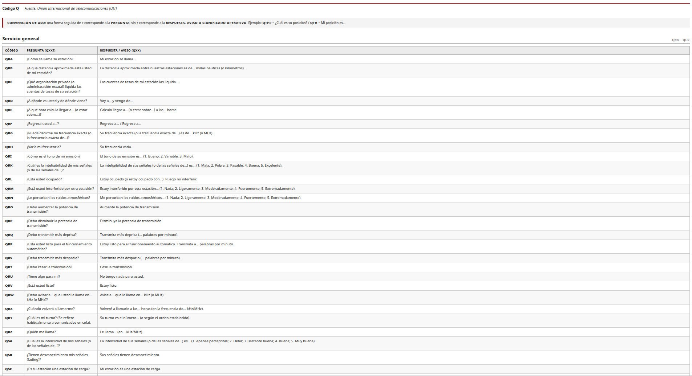
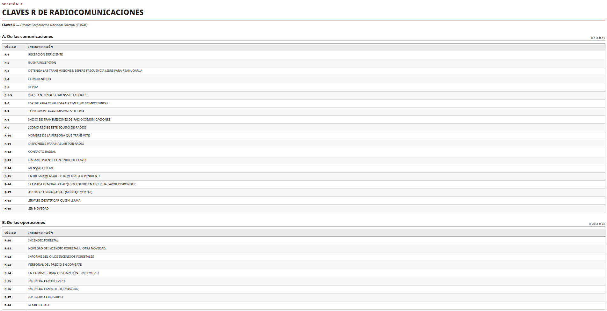

# Guía de Referencias Radiocomunicaciones

[](LICENSE)   [](https://github.com/2674321/guia-radiocomunicaciones-ca2opx/actions/workflows/ci.yml)


> Existen dos versiones de la guía — **Claves 10 Cuerpo de Bomberos de Coquimbo**: [web](manual_radiocomunicaciones.html) · [PDF](GUIA_RADIOCOMUNICACIONES.pdf) | **Códigos 10 Banda Ciudadana**: [web](manual_codigos10_generales.html) · [PDF](GUIA_RADIOCOMUNICACIONES_GENERAL.pdf)

> 🌐 **[Ver la guía online](https://2674321.github.io/guia-radiocomunicaciones-ca2opx/)** · [Descargar PDF](GUIA_RADIOCOMUNICACIONES.pdf)

<p align="center">
  

  <br><sub>Escanea para consultar la guía desde el celular</sub>
</p>

## Vista de la guía web

<p align="center">
  
  
  <br><sub>Interfaz de consulta online de la guía</sub>
</p>


Manual de campo de consulta rápida, formato **A4 vertical**, optimizado para impresión
(en color o blanco y negro). Edición personal de **CA2OPX**.

**Última revisión:** 21 de agosto de 2026

---

## Contenido del manual

El documento mantiene **cuatro sistemas completamente separados**, cada uno con su fuente declarada:

| Sección | Sistema | Fuente |
|---------|---------|--------|
| 1 | Código Q (convención `QXX?` / `QXX`) | Unión Internacional de Telecomunicaciones (UIT) |
| 2 | Claves R de Radiocomunicaciones | Corporación Nacional Forestal (CONAF) |
| 3 | Claves 10 | Cuerpo de Bomberos de Coquimbo |
| 4 | Alfabeto Fonético (ALFA · JULIETT · WHISKY) | OACI/ICAO — Deletreo radiotelefónico internacional |

> Las Claves 10 se reproducen íntegras desde su fuente primaria: no se completan,
> renumeran ni sustituyen claves ausentes, y los recursos despachados se conservan textuales
> (incluyendo «LO QUE DISPONGA CDCIA» y «SEGÚN REQUERIMIENTO DEL CB SOLICITANTE»).

## Archivos del repositorio

| Archivo | Descripción |
|---------|-------------|
| `GUIA_RADIOCOMUNICACIONES.pdf` | **PDF final listo para imprimir** (21 páginas A4) |
| `manual_radiocomunicaciones.html` | Fuente editable (HTML + CSS de medios paginados) |
| `FUENTE_RADIOCOMUNICACIONES.md` | Documento fuente estructurado (referencia primaria) |
| `build_pdf.py` | Genera el PDF desde el HTML con WeasyPrint |
| `check_integrity.py` | Control de integridad automatizado fuente ↔ documento |

## Regenerar el PDF

Requiere Python 3 y WeasyPrint (usa Pango/Cairo):

```bash
pip install weasyprint
python3 build_pdf.py
```

## Verificación de integridad

Compara automáticamente la fuente contra el documento generado:

1. Todas las Claves 10 presentes, sin duplicados ni omisiones.
2. Descripciones y recursos despachados intactos.
3. `CDCIA`, `COMANDANCIA` y `SEGÚN REQUERIMIENTO DEL CB SOLICITANTE` textuales.
4. Códigos R y códigos Q con significado idéntico a la fuente.
5. Alfabeto fonético con las 26 letras y nomenclatura OACI.
6. Fuentes separadas y declaradas; sin caracteres corruptos; tildes correctas.
7. Tablas con cabecera repetible y filas protegidas entre páginas.

```bash
python3 check_integrity.py
```
